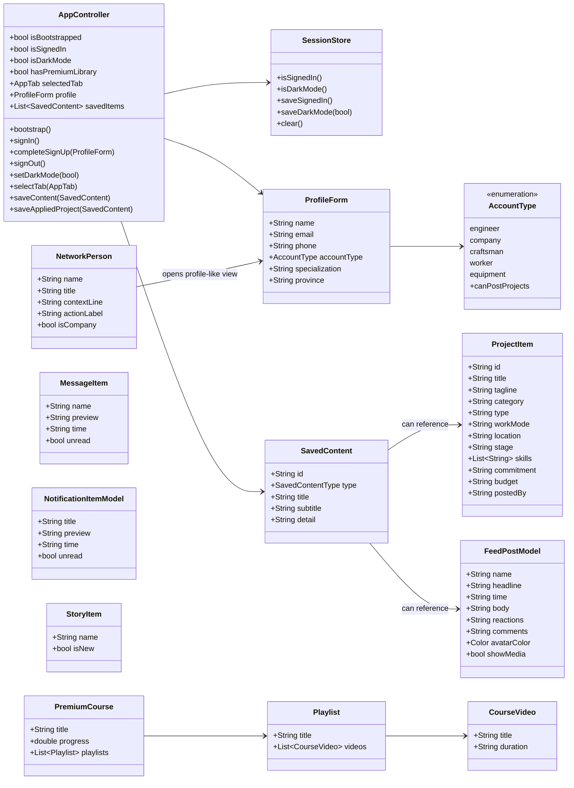
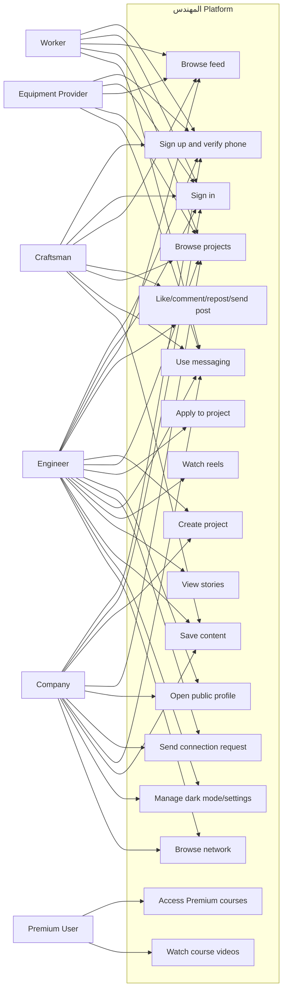
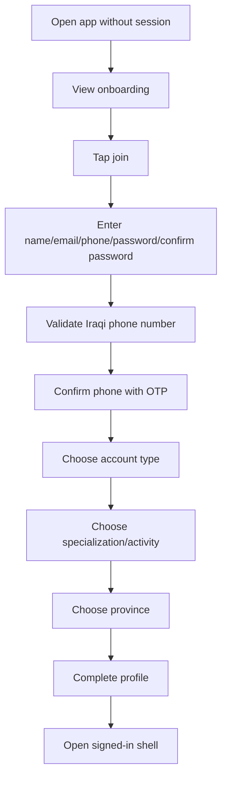
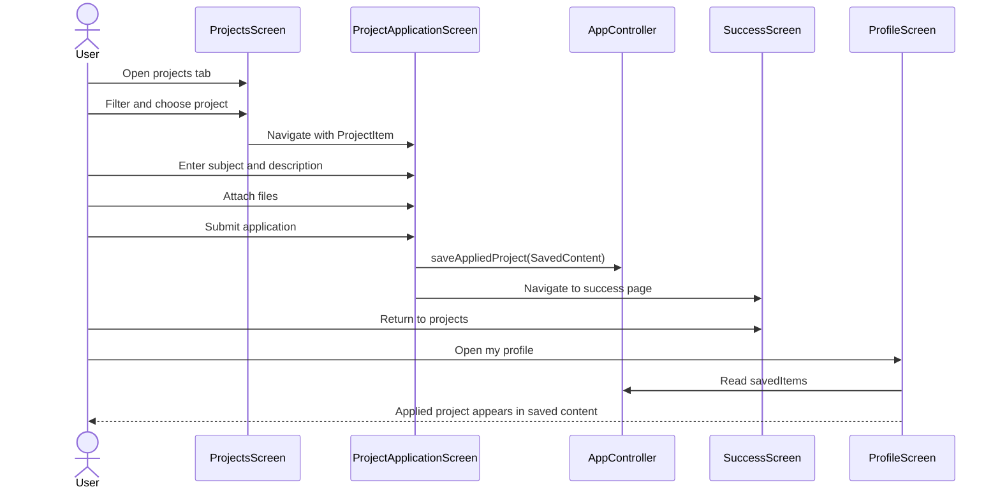
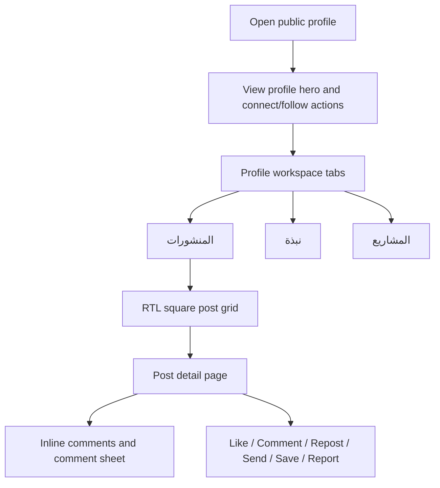
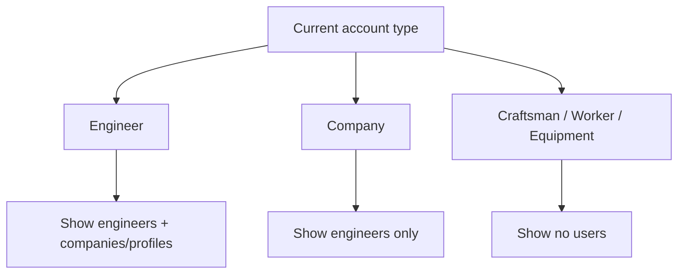
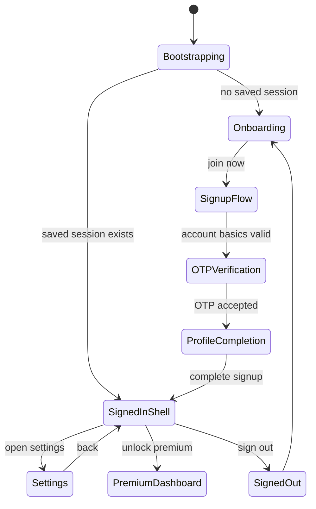

# Platform Overview: المهندس

## 1. Executive Summary

**المهندس** is a mobile-first, RTL Arabic Flutter application for an Iraqi engineering and construction collaboration platform. The product is designed around real projects rather than traditional job listings. It helps companies, contractors, engineers, craftspeople, workers, and equipment providers discover each other through project needs, professional profiles, posts, reels, stories, chat, and applications.

The core idea is:

> Connect field-ready engineering talent, construction companies, craftspeople, workers, and equipment providers through real projects and collaboration.

The platform is not positioned as a generic social network, job board, or freelance marketplace. It behaves more like a project ecosystem:

- Companies and engineers can publish projects.
- Engineers can discover all network categories and apply to collaborate.
- Companies can discover engineers and manage technical/project interest.
- Craftspeople, workers, and equipment providers can maintain presence and participate in collaboration flows, but do not post projects in the current rules.
- Premium users can access a course dashboard with construction-focused learning paths and video playback.
- Users build credibility through profile content, saved items, project applications, and visible activity.

The app is currently implemented as a Flutter prototype with local session persistence and in-memory sample data. It is structured in feature folders, shared widgets, models, and simple app-wide state controllers.

## 2. Product Positioning

### 2.1 What The Platform Is

المهندس is a construction and engineering collaboration platform focused on:

- Real field projects.
- Technical collaboration.
- Professional discovery.
- Construction team formation.
- Project applications.
- Work visibility through posts, reels, stories, and profiles.
- Skill and role matching across engineering and construction roles.

The app gives users a familiar social/professional experience, but the content and workflows are specialized for construction and engineering work in Iraq.

### 2.2 What The Platform Is Not

The platform is not:

- A generic LinkedIn clone.
- A pure job board.
- A pure freelancing marketplace.
- A generic social media app.
- A payroll or contract management product.
- A full project management system yet.

Some social patterns are used because they make professional discovery familiar: feeds, profiles, messaging, notifications, reels, stories, and saved content. However, the product purpose is project collaboration and field-work discovery.

## 3. Main Stakeholders

### 3.1 Engineer

Engineers are the broad professional users who can join projects, post projects, apply to projects, build a profile, and discover people or companies.

Examples:

- Civil engineer.
- Architect.
- Electrical engineer.
- Mechanical engineer.
- Survey engineer.
- Safety engineer.
- Site engineer.

Main goals:

- Discover real projects.
- Apply to collaborate.
- Build a visible professional profile.
- Save projects, posts, reels, and companies.
- Communicate with contacts.
- Showcase posts, projects, and field experience.
- Use Premium courses to improve construction/project skills.

Permissions:

- Can post projects.
- Can see engineers, companies, and other professional categories in the network page.
- Can apply to projects.
- Can access social and profile features.

### 3.2 Company

Companies represent organizations, contractors, offices, or founders that need engineers and field teams.

Examples:

- Construction company.
- Contracting firm.
- Engineering office.
- Equipment company.
- Real estate developer.

Main goals:

- Publish projects.
- Find engineers.
- Receive applications.
- Discover relevant professional talent.
- Communicate with potential collaborators.
- Build organization credibility.

Permissions:

- Can post projects.
- Can see engineers in the network page.
- Cannot see every category in the current network rule.

### 3.3 Craftsman

Craftspeople represent skilled trade professionals.

Examples:

- Builder.
- Plumber.
- Electrician.
- Painter.
- HVAC technician.
- Camera installation technician.
- Ceiling installer.
- Blacksmith.

Main goals:

- Maintain profile presence.
- Be discoverable through project collaboration.
- Communicate with engineers and companies.
- Participate in field-team workflows.

Permissions:

- Cannot post projects in the current rule.
- Cannot see other users in the network page in the current rule.

### 3.4 Worker

Workers represent construction labor users.

Examples:

- Construction worker.
- Site assistant.
- Skilled laborer.

Main goals:

- Create a simple profile.
- Receive visibility through project collaboration.
- Communicate when contacted.

Permissions:

- Cannot post projects.
- Cannot see network users in the current rule.

### 3.5 Equipment Provider

Equipment providers represent people or companies offering machinery and construction equipment.

Examples:

- Crane provider.
- Loader provider.
- Excavator provider.
- Truck provider.
- Generator provider.
- Concrete mixer provider.

Main goals:

- Be discoverable for projects needing equipment.
- Show machine type and location.
- Communicate with project teams.

Permissions:

- Cannot post projects in the current rule.
- Cannot see network users in the current rule.

### 3.6 Premium User

Premium is a user capability, not a separate account type. A premium user has access to the learning dashboard.

Main goals:

- Access courses.
- Track progress.
- Open playlists.
- Watch course videos with advanced playback controls.

### 3.7 Future Administrator

No full admin module is implemented, but a future admin stakeholder would likely be responsible for:

- Moderating reported posts.
- Verifying companies.
- Reviewing project quality.
- Managing Premium course content.
- Handling account abuse.
- Supporting payments or subscriptions.

## 4. Account Type Rules

The current product rules are:

| Account Type | Can Post Projects | Network Visibility |
|---|---:|---|
| Engineer | Yes | Sees everything |
| Company | Yes | Sees engineers only |
| Craftsman | No | Cannot see anyone |
| Worker | No | Cannot see anyone |
| Equipment Provider | No | Cannot see anyone |

These rules are implemented in the account-type model and are covered by widget/unit tests.

## 5. App Structure

The Flutter project is organized by responsibility:

```text
lib/
  app/
    linked_arabic_app.dart
  core/
    constants/
    theme/
  data/
    session/
  features/
    auth/
    composer/
    feed/
    home/
    jobs/
    menu/
    messages/
    network/
    notifications/
    onboarding/
    premium/
    profile/
    projects/
    reels/
    search/
    settings/
    stories/
  models/
  shared/
    painters/
    widgets/
  state/
test/
  widget_test.dart
```

### 5.1 `app/`

Contains the root application widget. It wires up:

- Material app configuration.
- RTL behavior.
- Theme mode.
- App state scope.
- Initial routing based on session state.

### 5.2 `core/`

Contains foundational constants and theme configuration:

- App color palette.
- Light/dark theme.
- Cairo font configuration.
- Theme extension helpers for surfaces, muted text, borders, and backgrounds.

### 5.3 `data/session/`

Contains session persistence via `shared_preferences`.

Responsibilities:

- Save signed-in state.
- Save dark mode preference.
- Clear local session.

### 5.4 `features/`

Each feature folder owns a user-facing area of the product:

- `auth`: sign in, sign up, phone/OTP flow, account profile collection.
- `composer`: post composer and project creation form.
- `feed`: home feed posts and post detail behavior.
- `home`: shell, top bar, bottom navigation.
- `menu`: sidebar drawer and premium entry.
- `messages`: chat list, chat detail, share-to-contact flow.
- `network`: connection suggestions, companies, invitations, profile access.
- `notifications`: notification list.
- `onboarding`: first-run marketing/onboarding slides.
- `premium`: courses dashboard, playlists, videos, progress cards.
- `profile`: my profile, public profile, profile content.
- `projects`: project discovery, filters, application flow, success page.
- `reels`: vertical reels feed with progress, comments, likes, share.
- `search`: search screen with people/projects/posts filters.
- `settings`: app settings and dark mode.
- `stories`: story strip and story viewer.

### 5.5 `models/`

The app uses simple immutable data models for UI and state:

- `AccountType`: user account type and permissions.
- `AppTab`: bottom navigation tab.
- `FeedPostModel`: feed and post detail content.
- `MessageItem`: chat list content.
- `NetworkPerson`: network cards.
- `NotificationItemModel`: notifications.
- `OnboardingSlide`: onboarding copy.
- `ProfileForm`: signup profile data.
- `ProjectItem`: project listing.
- `SavedContent`: saved posts/reels/projects/companies.
- `SettingsItem`: settings rows.
- `StoryItem`: stories.

### 5.6 `shared/`

Shared UI and drawing helpers:

- Avatars.
- Buttons.
- Logo.
- Comment sheet.
- Like animation.
- Custom painters for illustrations, cards, post media, and story visuals.

### 5.7 `state/`

State is intentionally lightweight:

- `AppController`: global app state.
- `AppScope`: inherited access to `AppController`.
- `SignupController`: signup flow state.

The app currently uses `ChangeNotifier` and inherited state rather than a larger state-management framework.

## 6. Technical Stack

| Layer | Technology |
|---|---|
| UI framework | Flutter |
| Language | Dart |
| State management | ChangeNotifier + custom scope |
| Local persistence | shared_preferences |
| Video playback | video_player |
| Font | Google Fonts Cairo |
| Testing | flutter_test |
| Platforms | Android, iOS, Web, Windows, Linux, macOS project structure |

## 7. Navigation Structure

The signed-in app is organized around a main shell with bottom navigation:

- Home / feed.
- Network.
- Post composer.
- Reels.
- Projects.

Additional navigation occurs through:

- Top bar search.
- Top bar messages.
- Sidebar drawer.
- Profile routes.
- Project application routes.
- Premium dashboard routes.
- Story viewer route.
- Post detail route.

## 8. Core User Journeys

### 8.1 First-Time User Onboarding

1. User opens the app without a saved session.
2. User sees onboarding slides.
3. User chooses to join.
4. Signup collects account basics.
5. User enters Iraqi phone number.
6. App shows OTP confirmation step.
7. User continues account-specific profile steps.
8. App completes signup and opens the signed-in shell.

### 8.2 Returning User Session

1. App starts.
2. `AppController.bootstrap()` reads local session state.
3. If signed in, the main shell is shown.
4. If not signed in, onboarding is shown.
5. Dark mode preference is applied during bootstrap.

### 8.3 Discover And Apply To Project

1. User opens the Projects tab.
2. User filters by sort, category, type, and work mode.
3. User chooses a project.
4. User taps apply.
5. User fills subject and description.
6. User may attach files.
7. User submits application.
8. Success page appears.
9. Applied project is saved into the user's profile saved content.

### 8.4 Create Project

1. Eligible user opens composer.
2. User chooses add project.
3. App opens project creation form.
4. User completes multiple steps:
   - Basics.
   - Overview.
   - Skills and tools.
   - Team and roles.
   - Timeline.
   - Budget and compensation.
   - Preview and publish.
5. User reviews preview.
6. Project can be published in the prototype flow.

Only engineers and companies should post projects.

### 8.5 Browse Network

1. User opens Network tab.
2. App checks account type permissions.
3. Engineer sees categories for professionals and companies.
4. Company sees engineers only.
5. Other account types see no users.
6. User can open public profile from visible cards.
7. User can send connection request.
8. Request button becomes pending.

### 8.6 Public Profile Interaction

1. User opens another person's profile.
2. Profile shows hero data and action buttons.
3. Profile content uses tabs:
   - Posts.
   - About.
   - Projects.
4. Posts show as square RTL grid cards.
5. User taps a post square.
6. App opens post detail page.
7. Post detail includes:
   - Post header.
   - Body/media.
   - Like count.
   - Comments.
   - Like/comment/repost/send actions.
   - Save/report menu.

### 8.7 My Profile Interaction

1. User opens drawer.
2. User taps profile/settings.
3. My profile opens.
4. My profile has tabs:
   - Posts.
   - About.
   - Saved content.
5. Secondary view-mode tabs appear only while posts are active.
6. Saved content includes saved posts, reels, companies, and applied projects.

### 8.8 Feed Interaction

1. User opens Home.
2. Stories appear at top.
3. Feed posts appear below.
4. User can:
   - Like and unlike.
   - See instant reaction count updates.
   - Open comments.
   - Confirm repost.
   - Send post to chat contact.
   - Save or report from menu.
   - Open profile from post header/avatar.

### 8.9 Reels Interaction

1. User opens Reels tab.
2. Vertical reels are shown.
3. User can swipe up/down.
4. Reel progress advances.
5. Completed progress moves to the next reel.
6. User can like, comment, repost, or send.
7. Comments open using the same comment pattern as posts.

### 8.10 Premium Course Journey

1. User opens sidebar.
2. User taps Premium.
3. Success message appears.
4. App opens Premium dashboard.
5. Dashboard shows courses and progress.
6. User opens a course.
7. User sees playlists and videos.
8. User opens a video.
9. Video player provides advanced controls.

## 9. Main Features

### 9.1 Authentication And Signup

The signup flow is account-specific and localized:

- Full name/company info depending on account type.
- Email.
- Required Iraqi phone number.
- Password.
- Confirm password.
- OTP phone confirmation.
- Account type selection.
- Specialization/activity details based on account type.
- Province/location selection.

The app currently uses mock/local session behavior, not a real backend authentication provider.

### 9.2 Home Feed

The feed is a professional construction/engineering activity stream:

- Posts about site work.
- Project needs.
- Coordination advice.
- Company project announcements.
- Like/comment/repost/send actions.
- Save/report menu.

### 9.3 Stories

Stories provide short, temporary visual updates:

- Story strip on home.
- Create-story first card.
- New story border.
- Story viewer.
- Progress bar.
- Swipe navigation.

### 9.4 Reels

Reels are vertical short-form videos/visual cards:

- Swipe up/down.
- Auto-progress to next reel.
- Like animation.
- Comments.
- Send to contacts.

### 9.5 Projects

Projects are the product center of gravity:

- Discovery list.
- Filters.
- Project cards.
- Application flow.
- Applied project saved to profile.
- Project creation flow through composer.

Project fields include:

- Title.
- Tagline.
- Category.
- Type.
- Work mode.
- Location.
- Description.
- Problem solved.
- Goals.
- Required skills.
- Tools/equipment.
- Roles.
- Team size.
- Timeline.
- Budget.
- Preview.

### 9.6 Network

Network is account-type aware:

- Engineers see people and companies.
- Companies see engineers.
- Other account types see no discoverable users.
- Invitations are separate.
- Connection requests use accept/reject icons.
- Public profiles are reachable from profile cards.

### 9.7 Messaging

Messaging supports:

- Chat list.
- Chat detail.
- Share-to-contact flow for posts/reels.
- Message input.

The current implementation is static/mock content, suitable for prototype behavior.

### 9.8 Profiles

Profiles are split into my profile and public profile.

My profile:

- Hero profile info.
- Posts tab.
- About tab.
- Saved tab.
- Secondary post view-mode tabs only when posts are active.

Public profile:

- Hero profile info.
- Connect/follow actions.
- Posts tab.
- About tab.
- Projects tab.
- Post squares open post detail.

### 9.9 Notifications

Notifications include:

- Reactions.
- Comments.
- Project recommendations.
- Simple drawer notification preview.
- Full notifications page.

### 9.10 Settings

Settings include:

- Account preferences.
- Sign-in and security.
- Visibility.
- Communications.
- Data privacy.
- Dark mode toggle.

### 9.11 Premium Courses

Premium includes:

- Course dashboard.
- Course progress.
- Course detail.
- Playlists.
- Video list.
- Video player.

Courses are construction/project themed.

## 10. State Management

The app uses a simple app-wide controller:

- `AppController` extends `ChangeNotifier`.
- `AppScope` exposes controller read/watch methods.
- `SignupController` handles signup progress.

`AppController` owns:

- Bootstrap state.
- Signed-in state.
- Dark mode state.
- Premium access.
- Selected bottom tab.
- Current profile form.
- Saved content list.

This structure is suitable for a prototype or small app. If the product grows, likely future candidates include Riverpod, Bloc, or a repository/service layer around network APIs.

## 11. Current Data Persistence

Local persistence is limited:

- Signed-in session flag.
- Dark mode preference.

Most content is currently static sample data or in-memory state:

- Feed posts.
- Reels.
- Network users.
- Notifications.
- Project listings.
- Premium courses.
- Saved content seeded in controller.
- Applied project saved in memory for the active app runtime.

Future backend persistence would likely include:

- Users.
- Organizations.
- Projects.
- Applications.
- Messages.
- Posts.
- Comments.
- Reels/stories.
- Saved items.
- Notifications.
- Premium subscriptions.
- Course progress.

## 12. Domain Model Summary

### 12.1 Key Entities

| Entity | Description |
|---|---|
| User/Profile | A signed-in person or organization profile |
| AccountType | Controls role and permissions |
| Project | A construction/engineering collaboration opportunity |
| ProjectApplication | User request to join a project |
| Post | Feed/profile content |
| Comment | Post/reel discussion |
| Story | Short status update |
| Reel | Short vertical media item |
| Message | Chat message/list item |
| SavedContent | Saved posts, reels, projects, companies |
| Notification | Activity alert |
| PremiumCourse | Course available to premium users |
| Playlist | Group of course videos |
| Video | Course video item |

### 12.2 Class Diagram



## 13. Use Case Diagram



## 14. Signup Flow Diagram



## 15. Project Application Sequence



## 16. Profile Content Flow



## 17. Network Visibility Logic



## 18. State Diagram



## 19. UI And Design Principles

The current UI follows these principles:

- Arabic-first RTL layout.
- Cairo font across the app.
- Blue primary color with neutral black/gray/white surfaces.
- Light and dark mode support.
- Mobile-first full-screen flows.
- Professional social interaction patterns.
- Construction-specific content and terminology.
- Rounded segmented tabs for profile sections.
- Bottom navigation with active primary top indicator.
- Reusable top bar with avatar, search, and messaging access.
- Visual but lightweight custom painters instead of heavy image assets.

## 20. Current Limitations

The app is currently a prototype and does not yet include:

- Real backend API.
- Real authentication or OTP provider.
- Real database.
- Real file upload.
- Real notification push service.
- Real chat transport.
- Real video content hosting.
- Real payment/subscription handling.
- Admin moderation dashboard.
- Company verification.
- Project team management backend.

These can be layered in later without changing the overall product direction.

## 21. Suggested Future Backend Architecture

A production backend could include:

- Auth service for phone/email/password and OTP.
- User/profile service.
- Company/organization service.
- Project service.
- Application service.
- Feed/content service.
- Messaging service.
- Notification service.
- Media upload service.
- Premium/course service.
- Moderation/report service.

Suggested persistent entities:

- users
- profiles
- organizations
- projects
- project_roles
- project_applications
- posts
- comments
- reactions
- reels
- stories
- messages
- conversations
- saved_items
- notifications
- premium_subscriptions
- courses
- playlists
- videos
- course_progress
- reports

## 22. Suggested API Resource Map

```text
POST   /auth/signup
POST   /auth/verify-otp
POST   /auth/signin
POST   /auth/signout

GET    /profiles/me
PATCH  /profiles/me
GET    /profiles/{id}

GET    /network
GET    /network/invitations
POST   /network/connect/{profileId}
POST   /network/invitations/{id}/accept
POST   /network/invitations/{id}/reject

GET    /projects
POST   /projects
GET    /projects/{id}
POST   /projects/{id}/applications
GET    /projects/applied

GET    /feed
POST   /posts
GET    /posts/{id}
POST   /posts/{id}/like
DELETE /posts/{id}/like
POST   /posts/{id}/comments
POST   /posts/{id}/save
POST   /posts/{id}/report

GET    /reels
GET    /stories

GET    /messages/conversations
GET    /messages/conversations/{id}
POST   /messages/conversations/{id}/messages

GET    /notifications
GET    /premium/courses
GET    /premium/courses/{id}
POST   /premium/videos/{id}/progress
```

## 23. Testing Strategy

The current test suite covers key product rules and user flows:

- Account type permissions.
- Onboarding and signup entry.
- Saved session shell opening.
- Dark mode toggle.
- Like count and color behavior.
- Reels behavior.
- Search and chat reachability.
- Network invitations and profiles.
- Stories/comments/repost confirmation.
- Share-to-chat flow.
- Premium dashboard and course playlists.
- Composer project flow.
- Project application and saved profile content.

This is a good base for prototype stability. Future tests should add:

- Golden/screenshot tests for RTL layout.
- Form validation tests.
- Backend integration tests.
- Permission tests for project creation.
- Media upload tests.
- Real navigation route tests.

## 24. Business Value

The platform creates value by reducing the distance between construction needs and capable contributors:

- Companies can form teams around actual projects.
- Engineers can prove ability through contribution rather than only resumes.
- Craftspeople and workers can become visible in a professional context.
- Equipment providers can be discovered when projects need machinery.
- Premium courses can increase user skill and retention.
- Profiles become practical portfolios tied to work, posts, projects, and saved/applied activity.

## 25. One-Sentence Product Definition

**المهندس is an Arabic RTL construction and engineering collaboration app where qualified users discover projects, form teams, communicate, apply, learn, and build visible professional credibility through real field work.**
